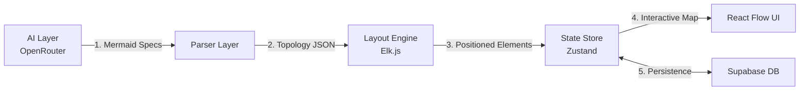

# Pipeline Architecture: Mermaid to React Flow (v2.0)

This document details the technical implementation of the "Builder AI" visualization pipeline. It serves as the blueprint for connecting the AI's textual output to the interactive React frontend.

**Version**: 2.0
**Core Stack**: OpenRouter, Supabase, Elk.js, Zustand, React Flow.

## 1. High-Level Flow



## 2. Detailed Pipeline Steps

### Step 1: AI Layer (The Writer)
**Gateway**: **OpenRouter**
**Responsibility**: Generate syntactically correct Mermaid.js code representing the mental map.
*   **Text Analysis**: Use standard efficient models (e.g., Llama 3, GPT-4o-mini).
*   **Image Analysis (Vision)**: **MUST** use Vision-capable models (e.g., GPT-4o, Gemini 1.5 Pro) via OpenRouter.
    *   *Usage*: Pass image (Base64/URL) to Planner Agent to generate initial specs.
*   **Input**: User Intent + Planner AI Specs.
*   **Output**: Raw String (Mermaid Syntax).
*   **Constraint**: Must Strictly use standard Mermaid graph syntax.

### Step 2: Parser Layer (The Bridge)
**Responsibility**: Transform raw string into a structured JavaScript object.
*   **Library**: `mermaid-parser`.
*   **Action**: Extract Nodes (ID, Label) and Edges (Source, Target, Label).

**Data Contract: `GraphTopology`**
```typescript
interface GraphTopology {
  nodes: Array<{ id: string; label: string; type?: string; }>;
  edges: Array<{ id: string; source: string; target: string; label?: string; }>;
}
```

### Step 3: Layout Engine (The Brain)
**Responsibility**: Calculate `x` and `y` coordinates for every node.
*   **Library**: **elkjs** (Eclipse Layout Kernel).
*   **Rationale**: We require advanced "Mental Map" handling (nested clusters, complex hierarchies) which Dagre lacks.
*   **Algorithm**: Use `mrtree` or `layered` algorithms for optimal distribution.

**Data Contract: `LayoutData`**
```typescript
interface LayoutData {
  nodes: Array<{
    id: string;
    position: { x: number; y: number };
    data: { label: string };
    width?: number;
    height?: number;
  }>;
  edges: Array<{ id: string; source: string; target: string; }>;
}
```

### Step 4: State Management (Zustand)
**Responsibility**: Manage the complex global state between Chat, Canvas, and AI generation.
*   **Library**: `zustand`.

**Store Structure**:
```typescript
interface AppStore {
  nodes: Node[];
  edges: Edge[];
  chatHistory: Message[];
  status: 'idle' | 'planning' | 'building' | 'structuring' | 'ready'; // For UX
  setNodes: (nodes: Node[]) => void;
  // ... actions
}
```

### Step 5: Persistence Layer (Supabase)
**Responsibility**: Save and load user maps.
*   **Technology**: **Supabase** (PostgreSQL).
*   **Schema strategy**:
    - `users`: Standard auth profile.
    - `maps`: id, user_id, title, created_at.
    - `versions`: id, map_id, content (JSON blob of `GraphTopology` or `LayoutData`), created_at.
*   **API**:
    - `GET /maps/{id}`: Fetch latest version.
    - `PUT /maps/{id}`: Save new version.

### UX: Progressive Loading
Instead of token streaming, use distinct phase indicators:
1.  **"Planning..."**: Planner AI analyzing intent/image.
2.  **"Building..."**: Builder AI generating Mermaid syntax.
3.  **"Structuring..."**: Elk.js calculating layout coordinates.
4.  **Fade In**: Final interactive Diagram appears.

## 3. Implementation Checklist

### Phase 1: Setup & Core
- [ ] Initialize React (Vite) + Zustand.
- [ ] Install `elkjs`, `reactflow`, `mermaid`, `@supabase/supabase-js`.

### Phase 2: Backend & AI
- [ ] Setup OpenRouter client (Python/Node).
- [ ] Implement Vision Handler for Image Uploads.
- [ ] Setup Supabase Project & Tables (`maps`, `versions`).

### Phase 3: The Pipeline Logic
- [ ] Implement `MermaidParser`.
- [ ] Implement `ElkLayoutService` (Configuration for complex maps).
- [ ] Connect `Zustand` store to React Flow.

### Phase 4: UI & Polish
- [ ] Build "Progressive Loader" Component (Status indicators).
- [ ] Implement Save/Load logic with Supabase.
